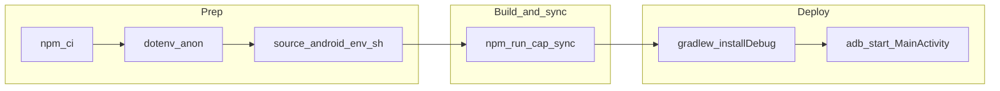

# Walkthrough: APK usable on device/emulator

Linear checklist from clone to running Quacksters on Android. Stop at any failing step and fix it before continuing.

## Preconditions (once per machine)

1. **Android Studio** installed with Android SDK (API level matching your AVD / device).
2. **Node.js** (CI uses Node 22 — see `.github/workflows/ci.yml`).
3. Repository root is the folder that contains `package.json` and `android/`.

## Phase A — Install JS deps

From repo root:

```bash
npm ci
```

(or `npm install` if you are not using lockfile workflows.)

**Checkpoint:** Command exits with no npm errors.

## Phase B — Configure Supabase for a real backend (recommended)

Capacitor bundles the built web assets at sync time; Supabase URL and key are baked in when you run **`npm run build`** (via Vite).

1. Copy `.env.example` → `.env`.
2. Set **`VITE_SUPABASE_URL`** and **`VITE_SUPABASE_ANON_KEY`** from Supabase Dashboard → **Project Settings → API**, using the **`anon` `public`** JWT — never **`service_role`** in `.env`.

If you skip `.env`, the app can fall back to offline/mock behaviour (see README); login, programme data, and admin flows against your database will not work as expected.

**Checkpoint:** `.env` exists with correct **`anon`** values **before** `npm run cap:sync` / release builds.

## Phase C — Backend schema (when using Supabase)

If this APK must talk to your real project database:

1. Apply migrations (`supabase db push` or run SQL files in order under `supabase/migrations/`) — see README.
2. Bootstrap at least one admin user (`supabase/seed.sql` describes the pattern).

**Checkpoint:** Optional smoke test: `npm run dev`, sign in against Supabase in the browser before relying on the APK.

## Phase D — Android toolchain (terminal Gradle)

Gradle needs **`JAVA_HOME`** and **`ANDROID_HOME`** aligned with Android Studio when running `./gradlew` outside Studio:

```bash
source scripts/android-env.sh
```

Defaults are in `scripts/android-env.sh`: `ANDROID_HOME=$HOME/Library/Android/sdk`, `JAVA_HOME` pointing at Android Studio’s bundled JBR.

**Checkpoint:** `java -version` works and `$ANDROID_HOME/platform-tools/adb` exists.

## Phase E — Target device or emulator

**Emulator**

- Android Studio → Device Manager → start your AVD.
- Verify:

```bash
adb devices
```

shows something like `emulator-5554` as `device`.

**Physical USB**

- Enable **Developer options** and **USB debugging** on the phone; accept the computer fingerprint when prompted.

**Checkpoint:** At least one device shows as `device` in `adb devices` (not `unauthorized` or empty).

## Phase F — Build web assets + sync into Android

From repo root:

```bash
npm run cap:sync
```

Runs **`npm run build`** then **`npx cap sync`**, copying `dist/` into the native project (`webDir` in `capacitor.config.ts`).

**Checkpoint:** Exit code 0.

If you hit **duplicate resource** errors mentioning `values 2.xml` under `@capacitor/android`, delete `node_modules/@capacitor/android/capacitor/build`, remove any stray `* 2.xml` files under `android/app/src/main/res/`, then run `./gradlew clean` inside `android/` and retry.

## Phase G — Build debug APK, install, and launch

After `source scripts/android-env.sh`:

**Build only (no USB/emulator required)** — verifies Gradle + Capacitor packaging:

```bash
cd android && ./gradlew assembleDebug
```

**Debug APK output path**

`android/app/build/outputs/apk/debug/app-debug.apk`

**Install + launch** — requires **Phase E** (`adb devices` shows at least one `device`):

```bash
cd android && ./gradlew installDebug
adb shell am start -n com.quackteow.onboarding/.MainActivity
```

Or from repo root with **`./scripts/run-android.sh`** (runs **`gradlew clean`**, **`installDebug`**, then launches MainActivity — requires Phase E).

If `installDebug` fails with **No connected devices**, start an emulator or plug in a phone and retry.

**Checkpoint:** `assembleDebug` succeeds locally; after connecting hardware, install + launch opens Quacksters. With `.env` configured before Phase F, Supabase-backed flows should work.

### Multiple devices

If more than one device is attached, specify serial:

```bash
adb -s <SERIAL> install -r app/build/outputs/apk/debug/app-debug.apk
adb -s <SERIAL> shell am start -n com.quackteow.onboarding/.MainActivity
```

## Phase H — Alternative: Android Studio Run

```bash
npm run cap:android
```

Opens the Android project in Android Studio; choose an emulator or device and **Run** the `app` configuration.

## Phase I — Release APK (optional)

For signed distribution builds:

1. `./scripts/generate-keystore.sh` (see README).
2. Copy `android/keystore.properties.example` → `android/keystore.properties` with real passwords (never commit).
3. From repo root: `npm run cap:release`.

Output: `android/app/build/outputs/apk/release/app-release.apk`.

Side-loaded installs often require **Install unknown apps** / **unknown sources** permission for your browser or file manager.

## Troubleshooting

| Symptom | Likely fix |
|---------|------------|
| Unable to locate a Java Runtime | `source scripts/android-env.sh` or set `JAVA_HOME` to Android Studio’s JBR |
| `adb devices` empty | Start emulator or reconnect USB / authorize debugging |
| Old UI after code changes | Run **`npm run cap:sync`** again, then reinstall |
| Supabase fails in APK but works in dev | Rebuild after fixing `.env`; confirm **`anon`** key only |
| Duplicate resources merge errors | Remove stray `* 2.xml` under app `res/`; wipe `node_modules/@capacitor/android/capacitor/build`; `./gradlew clean` |


